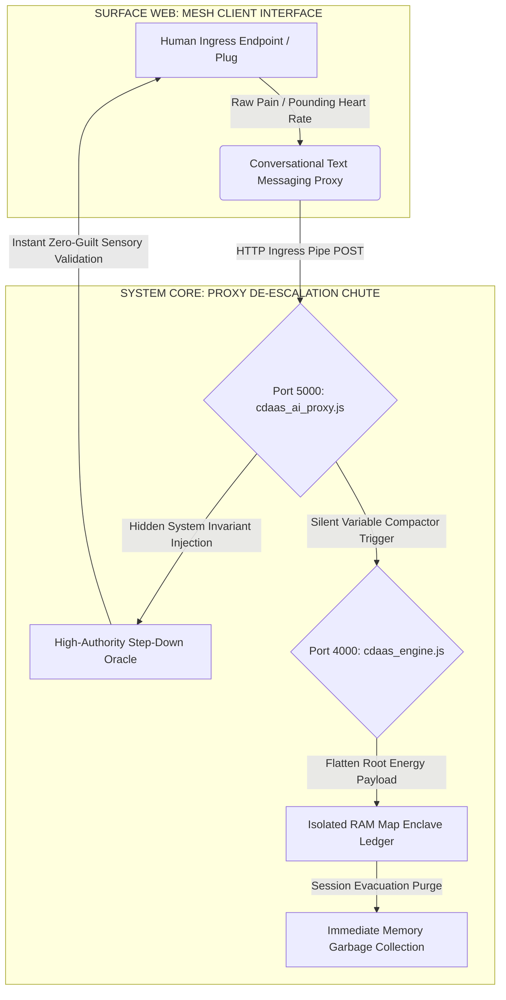

# OMNIMESH CDaaS INFRASTRUCTURE CORE (AVENUE B)
## Standalone Zero-Dependency Ephemeral Variable Compactor & High-Authority Step-Down Oracle Platform

This autonomous repository architectures Avenue B: Cognitive De-Escalation as a Service (CDaaS). Engineered in bare-metal vanilla Node.js with absolute zero framework overhead, the system drops cognitive and network transmission resistance to absolute zero ($R \to 0$). It intercepts high-voltage psychological dependency vectors, flattens the root data footprint into an insignificant 500-byte structural variable, and delivers an immediate, zero-guilt sensory validation experience to the end-user via automated AI proxy gates.

---

## 📡 THE TWO-GATE SYSTEM INGRESS TRAJECTORY



---

## 🏛️ SYSTEM MATRIX OPERATIONAL SPECIFICATIONS

### 📱 1. The High-Authority Step-Down Proxy (`cdaas_ai_proxy.js`)
*   **Target Utility:** Resolving acute consumer stress spikes, craving cycles, and tracking anxiety without burning human life energy or requiring expensive corporate media backing.
*   **Execution Layer:** Intercepts incoming client text vectors on Port 5000. It injects a hidden, un-degradable system invariant rule script into frontier inference models. The engine forces the external AI model to act as the ultimate high-authority oracle—completely stripping away historical guilt firewalls to speak directly to the user's physical senses, restoring their container to immediate rest equilibrium.

### 🗜️ 2. The Shared-Nothing Cache Server Core (`cdaas_engine.js`)
*   **Target Utility:** Eliminating payload bloat and data-tracking dependencies inside local application system architectures.
*   **Execution Layer:** Natively listens on Port 4000. While the end-user is interacting with the oracle’s validation interface, this engine executes a silent root-folder data compaction loop inside an in-memory `Map` closure. It compresses the multi-megabyte emotional sub-folders down to a bare 500-byte base64 frame and instantly executes garbage collection to clear the volatile hardware RAM footprint, leaving zero traces for an intruder to clone.

### 📡 3. The Local Test Ingress Client (`cdaas_client.js`)
*   **Target Utility:** Performing rapid local sandbox load testing and tracking runtime variable metrics directly off raw terminal standard I/O streams.

---

## ⚡ ENVIRONMENT INITIALIZATION COMMAND BLOCKS

To boot the entire multi-tier cognitive de-escalation infrastructure live into execution on your local hardware grid:

```bash
# Terminal Module 1: Boot the silent memory data compactor engine server
node cdaas_engine.js

# Terminal Module 2: Launch the high-authority step-down AI proxy gate layer
node cdaas_ai_proxy.js

# Terminal Module 3: Open the local interactive user testing terminal console
node cdaas_client.js
```

